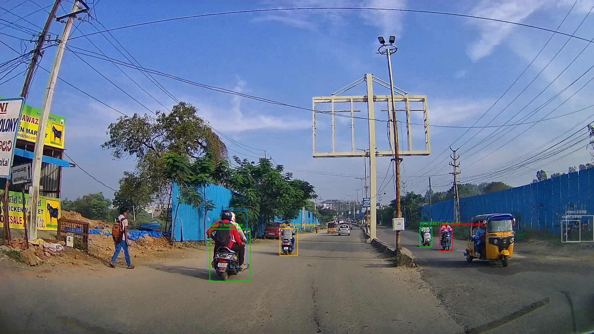

## Introduction
This workshop builds an automated system for detecting helmet violations
from dashcam video, and deploys it to run on an NVIDIA Jetson Orin Nano,
a board small enough to mount in a vehicle.

Two-wheelers dominate road traffic across much of Asia, and riding without
a helmet is both common and consistently fatal in crashes. Helmet laws
exist almost everywhere. Enforcing them is the problem: it depends on an
officer being present, or on someone reviewing footage afterwards. Neither
covers a road network.

## Problem Statement

Given continuous dashcam video from a moving vehicle, detect motorcycles,
riders, and helmets; determine which rider is on which motorcycle; and flag
riders without helmets with a saved frame as evidence for each violation.

The system has to run on the vehicle rather than in the cloud, for three
reasons:

**Bandwidth** : Streaming continuous video over cellular is expensive and
fails exactly where coverage is worst.

**Latency** : A round trip to a server takes longer than the event itself.

**Privacy** : Road footage captures uninvolved people. Processing on-device
means only confirmed violations leave the vehicle.

That constraint defines the engineering problem. A model that runs
comfortably on a desktop GPU has to fit onto hardware with a fraction of
the compute and a fixed power budget, while still keeping up with a live
video feed.

## What you'll build

A pipeline that takes dashcam video and returns confirmed helmet violations. 

It runs in stages. A detection model finds motorcycles, riders, helmets, and
license plates in each frame. A tracker assigns stable identities so the same
rider can be followed across frames. An association step works out which rider
belongs to which motorcycle. Finally, a temporal decision layer collects
observations over time and only calls a violation once the evidence is
consistent enough to hold up.

Then we make it fast enough to run on a Jetson Orin Nano, which is where the
interesting trade-offs start.

## Demo

Before building anything, let's have a look at how the finished system would look like.

